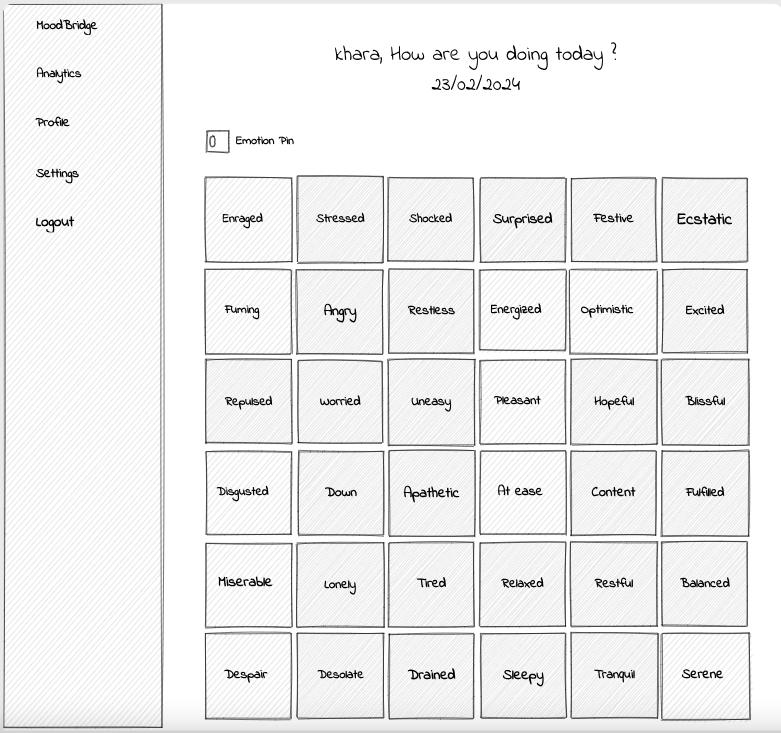
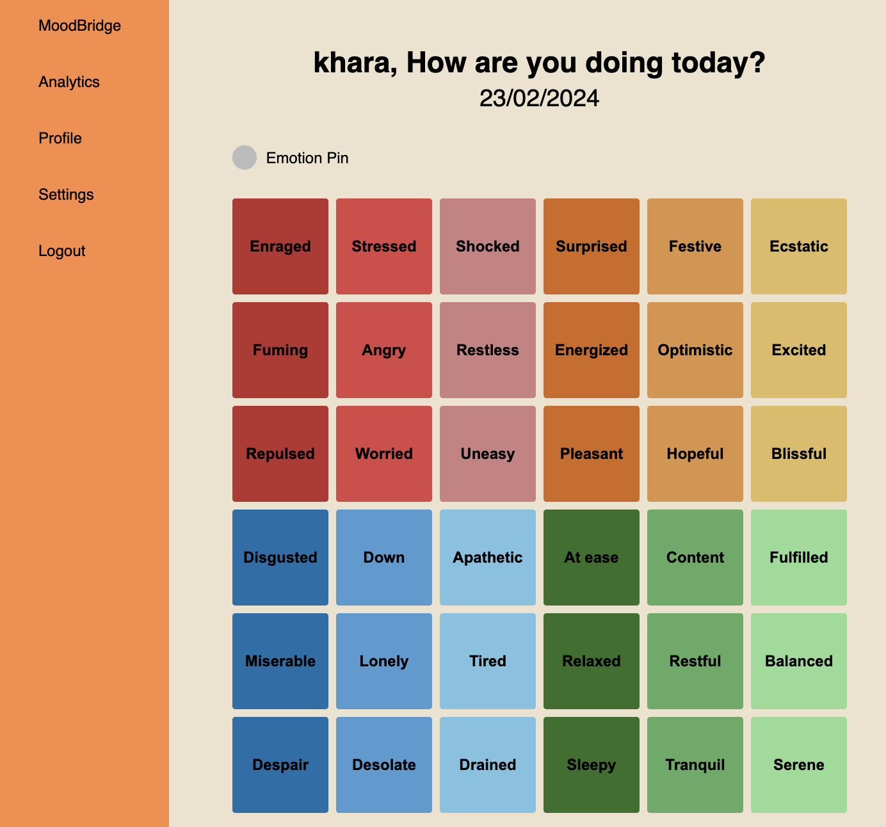

# MoodBridge
This is a web app that allows users to track their daily emotions, activities, and notes, and will eventually enable connectivity with a partner for mood sharing and analysis. 

- [Overview](#overview)
  - [Wireframe](#wireframe)
  - [Screenshot](#screenshot)
  - [Links](#links)
- [My process](#my-process)
  - [Built with](#built-with)
  - [Continued development](#continued-development)

## Overview

### Wireframe

### Screenshot

### Links
- Live Site URL: [Add live site URL here](https://your-live-site-url.com)

## My process

### Built with

- Semantic HTML5 markup
- CSS custom properties
- JavaScript
- Flexbox
- CSS Grid
- PHP
- ChartJS

### Continued development

Hope to add partner functionality very soon where the application acts as a bridge between partners to help them idenitify moods and become more transparent with each other.
- **User Pairing**: Enable users to connect with a partner within the system.
- **Mood Sharing**: Implement a feature that allows connected partners to view each other's selected moods.
  
Also add further develop algorithms to analyze the mood data and generate insights.
- **Comparative Mood Analysis**: Side-by-side bar graphs comparing the mood selections of the user and their connected partner(s) over a chosen period, facilitating awareness of emotional synchrony or differences.
- **Weekly/Monthly Mood Summaries**: Summarized visualizations, such as stacked bar graphs or area charts, presenting a weekly or monthly overview of mood distributions to track long-term emotional trends.

Another future development would be the migration into using vue3. 

